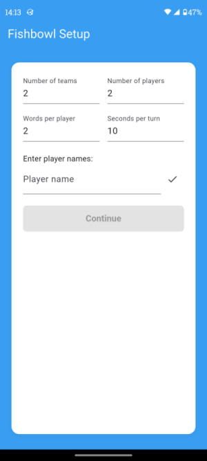
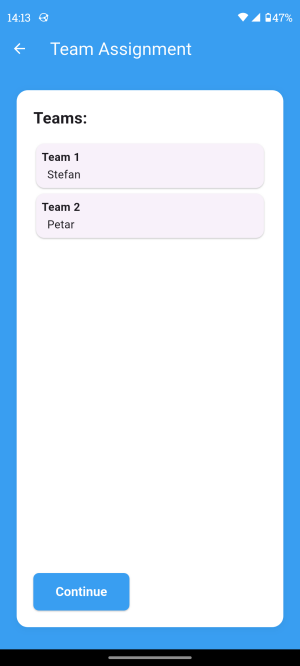
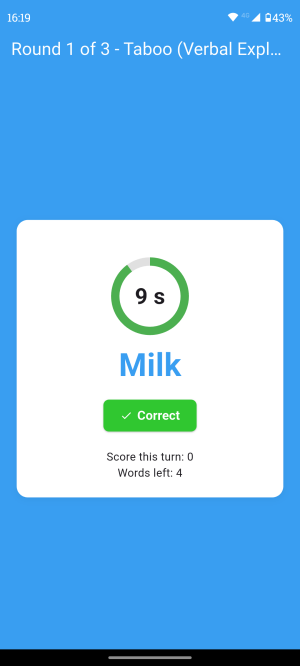
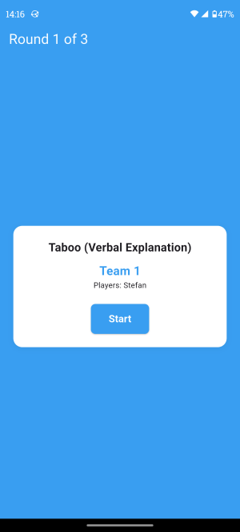
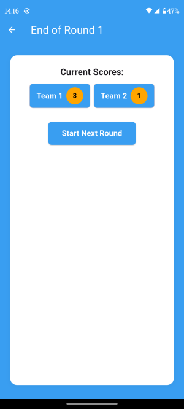

# 🐠 Fishbowl Game

**Fishbowl** is a fun, team-based party game where players try to guess words or phrases from a "fishbowl" across **three rounds** each with different rules.  
This project is a **Flutter application prototype** that allows teams to play Fishbowl digitally, no paper, no pens, no setup hassle!

## 💡 Project Idea

This project was born from a **Team Building event** where we wanted to play *Associations (Fishbowl-style)* but forgot paper and pens.  
That moment inspired me to create a **digital version** of the game and to test how far I could go using **AI-assisted app development**.

I used **GitHub Copilot** to help generate code and build the app structure, and I wanted to explore how quickly a playable prototype could be made **without manually writing much code**.  
The initial version took about **one hour of communication with the AI agent**.

## 🎯 Game Overview

The game consists of **three rounds** using the same set of words:

1. **Round 1 – Taboo (Verbal Explanation):**  
   The player describes the word using any words **except the word itself**.

2. **Round 2 – Charades:**  
   The player acts out the word **without speaking**.

3. **Round 3 – One Word:**  
   The player can use **only one word** to describe the term.

Teams take turns trying to guess as many words as possible within the given time limit.

## 🧩 How It Works

### **1. Setup Screen**
- Enter:
  - Number of teams  
  - Number of players  
  - Number of words per player  
  - Time limit (seconds per turn)
- Then, input player names one by one.
- Once all players are added, the app will **randomly assign players to teams**.

### **2. Teams Overview**
- The next screen displays all teams and their assigned players.
- Press **Next** to continue to the word submission phase.

### **3. Word Submission**
- Each player enters their assigned number of words.
- When everyone has submitted their words, the game can begin.

### **4. Gameplay**
- The screen shows:
  - The **current team**
  - The **current round name and number**
  - A **Start** button
- When the round starts:
  - The first word appears on screen.
  - A **Correct** button lets players confirm when a word is guessed.
  - Each correct answer increases the team’s score.
  - The round continues until all words are guessed or time runs out.

### **5. End of Game**
- After all three rounds are completed, a **Results screen** shows the final team scores.

## 🛠️ Tech Stack

- **Framework:** Flutter  
- **Language:** Dart  
- **IDE:** Visual Studio Code  
- **Plugins:** Flutter & Dart extensions for VS Code  
- **AI Assistance:** GitHub Copilot  

## 🚀 Future Improvements

- Persistent storage (save scores and teams)
- Improved UI/UX design
- Online multiplayer mode
- Sound effects and animations
- Round history and replay options

## 📱 Purpose

The goal of this project is twofold:
1. To create a digital Fishbowl game for fun and easy team-building sessions.  
2. To explore how **AI tools** like Copilot can accelerate app development and make Flutter app creation accessible even without deep coding experience.

## 🌍 Open Source Vision

This project is intended to grow as an **open-source community effort**.  
I would love for this app to **live, evolve, and improve** through collaboration, whether through design ideas, feature contributions, or code improvements.  

If you enjoy the concept or see potential in it, feel free to:
- Fork the repo  
- Open pull requests  
- Share suggestions or feedback  

Together, we can make *Fishbowl Game* a fun and polished app for everyone to enjoy! 💪

## 📄 License

This project is released under the **MIT License**.  
Feel free to fork, modify, and improve it!

### 👤 Author

**Created by:** Andrej  
**Inspiration:** Team Building fun and the power of AI-assisted coding 💡

## 📸 Screenshots

Here are a few preview screens from the Fishbowl Game app:

### 🏠 Home Screen

### 👥 Team Overview

### 🎮 Gameplay

### 🎮 Start of Round

### 🎮 End of Round
